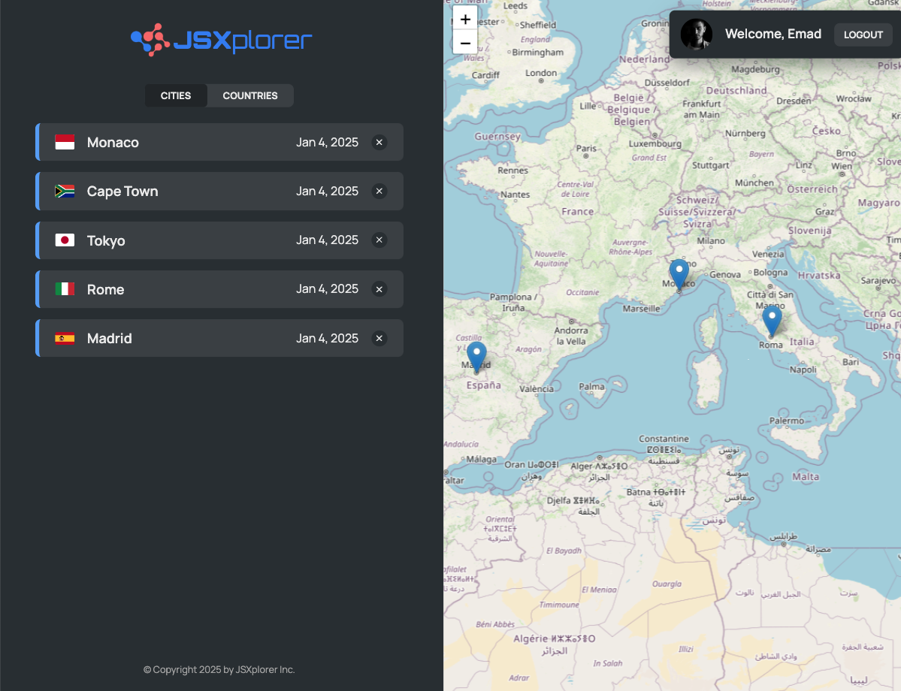

# 🌍 JSXplorer

JSXplorer is a modern, interactive web application for exploring cities and countries. Built with React, TypeScript, and modern state management, it provides a seamless experience for users to navigate and interact with geographical data.

## 🖼️ Screenshots

### 📌 Home View

### 📌 Map View

## 🚀 Features

- 🔐 **Authentication** (Login system with a fake user)
- 🗺️ **Interactive Map** (Powered by Leaflet)
- 📌 **City & Country Data** (Fetched from an API or local JSON)
- 📍 **Geolocation** (Reverse geocoding with an external API)
- ⚡ **Optimized Performance** (Lazy loading & Suspense)
- 🔥 **Error Handling** (Error Boundaries with a custom fallback UI)
- 📂 **Context API** (Efficient global state management)
- 🎨 **Styled Components** (CSS modules for modular styling)
- 🚦 **Routing** (Protected routes with React Router)
- ⚙️ **Development Server** (Powered by `json-server` for local API simulation)

## 🛠️ Tools & Technologies

- ⚛️ **React** – Component-based UI development.
- 🟦 **TypeScript** – Strong typing for reliability.
- 🌍 **React Router** – Navigation between different views.
- 🗺 **Leaflet.js** – Interactive map rendering.
- 🔥 **Vite** – Fast development and build process.
- 🏗 **Context API & Reducers** – State management.

## 🔗 Live Demo

- 🌍 [Try JSXplorer Now!](https://jsxplorer-emadabaei.vercel.app)

## 🧪 Testing

- Tests are not implemented yet, but they will be added soon using **Vitest** and **React Testing Library** to ensure reliability and maintainability.

## 📂 Setup & Installation

1️⃣ Clone the repository:
git clone https://github.com/emad-abaei/JSXplorer.git

2️⃣ Navigate to the project directory:
cd JSXplorer

3️⃣ Install dependencies:
npm install

4️⃣ Start the json server:
npm run server

5️⃣ Start the development server:
npm run dev

## 🙌 Acknowledgments

This project was originally inspired by a course from **Jonas Schmedtmann**. While the core idea comes from the course, I have made several enhancements, including:

I extended the project by:  
✅ **Migrating from JavaScript to TypeScript** for better type safety and maintainability.

✅ **Refactoring and optimizing the codebase** for cleaner, more efficient development.

## 📩 Contributing

Contributions are welcome! Feel free to submit issues or pull requests.

## 📜 License

This project is licensed under the MIT License.
